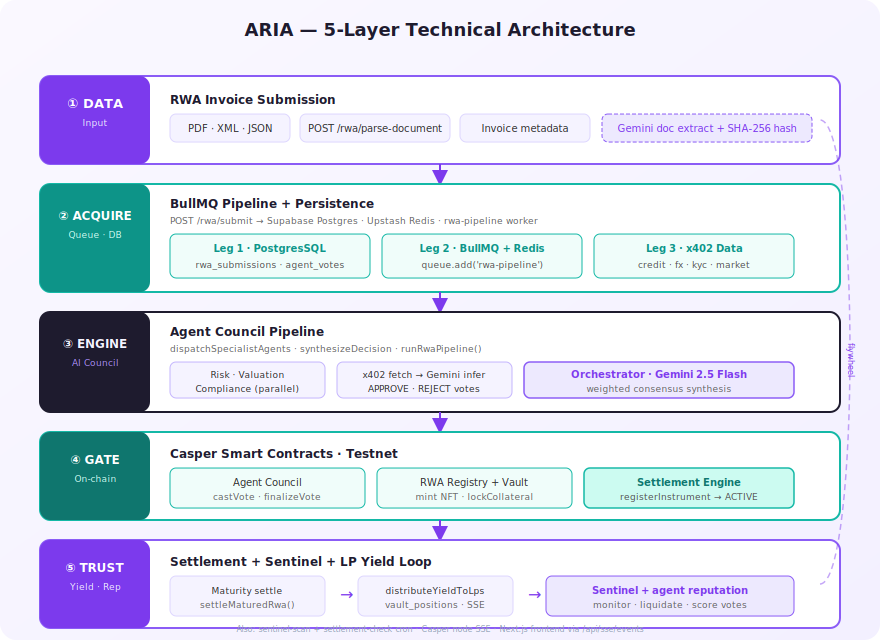

# ARIA — Autonomous RWA Intelligence Agent

> **A $50,000 invoice sits in a drawer. A factory waits for cash. A bank wants three weeks of paperwork.**
>
> ARIA closes that gap in minutes — not with another dashboard, but with a **council of AI agents** that read the invoice, pay for credit data, vote on-chain, mint a collateralized NFT, and route liquidity from a DeFi vault. Every decision is signed. Every asset is auditable. Every yield is real cash flow from settled invoices — on **Casper**.

Built for the [Casper Agentic Buildathon 2026](https://www.casper.network/ai) · Casper Testnet · Open source.


## Problem Statement

Small and mid-sized enterprises (SMEs) worldwide rely on **trade finance** — invoices, purchase orders, and receivables — to keep operations running. Yet accessing liquidity against these assets remains painfully slow:

- **Manual underwriting** takes days or weeks; credit committees are expensive and opaque.
- **Off-chain paperwork** doesn't travel — investors can't verify claims or enforce recourse digitally.
- **DeFi liquidity** exists, but lacks a trust layer for real-world assets: who validates the invoice? Who prices the risk? Who signs on-chain?

The result: idle capital on one side, unfunded invoices on the other, and no autonomous bridge between them.


## Solution

**ARIA** (Autonomous RWA Intelligence Agent) is an agentic underwriting and liquidity platform on Casper Network. Agents don't just advise — they **analyze, pay, vote, sign, monitor, and settle** autonomously. Humans submit invoices and deposit liquidity; everything in between is agent-driven and on-chain auditable.

### End-to-end flow

1. **Submit** — An SME uploads a trade finance document (PDF/XML/JSON). Gemini extracts structured fields; a SHA-256 hash anchors provenance.
2. **Council deliberates** — Risk, Valuation, and Compliance agents run in parallel, each producing an APPROVE/REJECT vote with reasoning.
3. **Consensus → chain** — The Orchestrator synthesizes votes with Gemini. Approved assets trigger: council vote finalization on `AgentCouncil`, **CEP-78 NFT mint** on `RwaRegistry`, collateral lock in `LiquidityVault`, and instrument registration in `SettlementEngine`.
4. **Earn yield** — LP depositors fund the pool. At maturity, settlement repays principal + interest; net yield distributes pro-rata to ARIA-LP holders.

The **Observatory** streams live agent deliberations via SSE. The **Vault** shows TVL, utilization, and on-chain proof of every funded claim.

### What makes ARIA different

**Agents pay for their own data (x402)**  
Risk, Valuation, and Compliance agents don't scrape free APIs — they settle **x402 micropayments** before every external call (credit bureau, FX rates, KYC, market data). Each payment carries cryptographic proof; larger amounts settle on-chain in CSPR. Data acquisition is machine-to-machine commerce, built into the underwriting pipeline — not a demo sidebar.

**Agents make binding decisions — humans don't underwrite**  
Each council agent holds its own ED25519 key, runs Gemini inference on paid data, and **casts a real on-chain vote** via `AgentCouncil`. The Orchestrator only synthesizes consensus — it does not override specialist votes. Approval requires council quorum (3-of-3 votes); only then does the pipeline mint the RWA NFT, lock vault collateral, and register the instrument. The human appears at submission and deposit — not in the credit committee.

**Sentinel Agent — 24/7 post-approval monitoring**  
After an asset goes ACTIVE, the **Sentinel** runs on a scheduled BullMQ job (`sentinel-scan`). It re-evaluates live positions with Gemini, emits `SENTINEL_ALERT` events to the Observatory, and can **trigger on-chain liquidation** when risk delta exceeds the configured threshold — protecting LP capital without manual intervention.

**Agent Reputation — on-chain accountability loop**  
Every council vote is recorded in Postgres and on-chain. When an RWA reaches a terminal outcome (settled or defaulted), `scoreAgentReputationsForRwa()` scores each agent: **APPROVE on a repaid asset = correct; REJECT on a default = correct**. Scores persist in `agent_reputation` and sync to `RwaRegistry.update_reputation` on Casper Testnet. Over time, agents build a verifiable track record — a self-improving meritocracy for AI underwriters.

**Automated Settlement — real yield, not synthetic APY**  
The `settlement-check` cron scans matured instruments and runs `settleMaturedRwa()`: on-chain repayment via `SettlementEngine`, yield received into the vault, collateral released, and **pro-rata yield distributed** to LP positions (`distributeYieldToLps`). Pool Yield Realized and per-wallet YIELD EARNED reflect actual settled cash flows — the 18% APY shown in the Vault is a forward estimate until invoices mature.


## Tech Stack

| Layer | Technology | Role in ARIA |
|-------|------------|--------------|
| **Frontend** | Next.js 16 · React 19 · Tailwind · TanStack Query · Zustand | Dashboard: Submit · Observatory · Vault · Portfolio |
| **Backend** | Node.js · Express · TypeScript · BullMQ · node-cron | REST API, job queues, agent orchestration |
| **Database** | PostgreSQL (Supabase) | RWA submissions, agent votes, vault positions, settlement events |
| **Queue / Cache** | Redis (Upstash) + BullMQ | `rwa-pipeline` · `sentinel-scan` · `settlement-check` workers |
| **LLM** | Google Gemini 2.5 Flash | Agent reasoning, document parsing, council synthesis |
| **Blockchain** | Casper Testnet · casper-js-sdk | Deploys, queries, wallet signing |
| **Smart Contracts** | Odra (Rust/WASM) | RWA Registry · Agent Council · Liquidity Vault · Settlement Engine |

### Casper Ecosystem Impact

ARIA is built to showcase Casper as the trust layer for agentic RWA underwriting — every specialist agent pays for data, signs with its own key, and leaves an auditable trail on Testnet.

| Toolkit Component | How ARIA Uses It |
|-------------------|------------------|
| **Odra Framework** | Four WASM contracts on Casper Testnet: `RwaRegistry` (CEP-78 NFT), `AgentCouncil` (quorum votes), `LiquidityVault` (LP deposits + collateral lock), `SettlementEngine` (maturity / repayment). |
| **x402 Micropayments** | Risk, Valuation, and Compliance agents settle HTTP-native micropayments before credit / FX / KYC / market calls. Small amounts use signed deploy proofs; larger amounts use on-chain CSPR transfers (see sample tx `32cd42a4…`). |
| **Agent Keys (ED25519)** | Each agent (Risk, Valuation, Compliance, Orchestrator, Sentinel) holds its own key pair. Council votes are signed and broadcast autonomously — humans submit invoices and deposit liquidity; agents underwrite. |
| **CSPR.cloud APIs** | Deploy status polling, node RPC, and event watching for mint / lock / settlement finality. |
| **MCP Servers** | Scaffold client for Casper MCP / CSPR.trade is initialized at startup; the live pipeline today uses `casper-js-sdk` + CSPR.cloud. Production MCP wiring is on the roadmap. |


## Architecture





## Demo

https://www.youtube.com/watch?v=Jv1iwIuFSjE

**Live app:** [https://aria-rwa.vercel.app](https://aria-rwa.vercel.app) · Explorer: [testnet.cspr.live](https://testnet.cspr.live)


## Contract Package Hashes & Transactions

All contracts are Odra WASM deployed on **Casper Testnet** (2026-06-28). Deploy hashes below are verified sample transactions from the live pipeline.

### Contract Package Hashes

| Contract | Package Hash |
|----------|--------------|
| RWA Registry | `hash-9a714722643a34ae7885e7fc28ea6ceef2b6179b4c768c2ebe2e69a9f389c61d` |
| Agent Council | `hash-c143ab5eaaa394df26ac09fe5b666a1acb9ee35138da0828e7c7b31347701378` |
| Liquidity Vault | `hash-2f0db1a537ecbeae56f1fdbd083fcb5cf399ef7d71c8d1524bccaa43002ded1a` |
| Settlement Engine | `hash-a3eeedaae342d47d59e20bf788ac03200b42db6adac675324116c105a032e2f2` |

### Contract Instance Hashes (Active on Testnet)

| Contract | Instance Hash |
|----------|---------------|
| RWA Registry | `contract-63efcdfdc1bae5592a4068405801c544af8009ab181f37a6204a5e1bd19c5c69` |
| Agent Council | `contract-e7ba3ae8aa5fac2188dd80ec479eae6a566829702fa6535685042b072cce60d4` |
| Liquidity Vault | `contract-30436012b4709630caf91c3e3889d9ef94f2036a98dc13a92f8a8562093bd935` |
| Settlement Engine | `contract-b5c87e29e58df717d93719ab5d0abf86793a2bd2c7feaca2f9b762e930714eff` |

### Agent On-Chain Public Keys (ED25519)

| Role | Public Key |
|------|------------|
| Deployer / Minter | `016126bc3a5d205b3c84871ccbeebb4fcd69b1745da5b00d29216d0565bb322029` |
| Risk Agent | `01e9d6f0a38e00a665b8c864f2d74c932a0699e7def73f3930ca458e80589ca26a` |
| Valuation Agent | `01af0a2294669ffe09b4eec0aa8fa30435028370330f9b934504e8fe4462afd69f` |
| Compliance Agent | `011dbbc6383705af7e1055fea16b46178de77c650ce5f16a272e3b21a9a377884f` |
| Sentinel Agent | `0103dbf72b1e0f2e74d50cf76d3c47888a7a1ed81af125afdcc3ded67313c028e4` |
| Orchestrator Agent | `018f9280b1ccbbd58d939bf664f12e6acd65698e3981f5b6a6a1a24a5668dceabd` |

### Sample Testnet Transactions

Explorer link format: `https://testnet.cspr.live/deploy/{hash}`

**Agent Registration (`AgentCouncil.register_agent`)**

| Agent | Deploy Hash |
|-------|-------------|
| Risk | [`3ebc39f9…`](https://testnet.cspr.live/deploy/3ebc39f98ac6e1326fc246b95958bda0bf70bbdb20de29711a6cca23293bd31a) |
| Valuation | [`1641dc99…`](https://testnet.cspr.live/deploy/1641dc99b4c7892b4bd7a130a2aa3d5202a0a01b3256963a99f0a97adae0c3b7) |
| Compliance | [`277b81e6…`](https://testnet.cspr.live/deploy/277b81e6de8f293000f82252582a29d779bc294db0d546cf13e29d9926c782db) |
| Sentinel | [`e95498ff…`](https://testnet.cspr.live/deploy/e95498ff48d6a2c57fe75e064d759a684767455218d536e42249a47bd7cf8fdc) |

**x402 Micropayment**

| Event | Deploy Hash |
|-------|-------------|
| On-chain payment transfer | [`32cd42a4…`](https://testnet.cspr.live/deploy/32cd42a48eb8ec78d931d1de9c8499e3c89811b683341cc25ee026f96651e581) |

**Full Pipeline — Acme Corp $48k Invoice** (`d4016990…` · ACTIVE · NFT #6)

| Step | Deploy Hash |
|------|-------------|
| Risk APPROVE | [`2e26347c…`](https://testnet.cspr.live/deploy/2e26347cce7234b0ae2c63c418f85207f7b642108d3316aa807871b05eed55e0) |
| Valuation APPROVE | [`fbdb23aa…`](https://testnet.cspr.live/deploy/fbdb23aa5f2ad23032e2ad828604ec9e49cb7a3e802d0b169ff355a5b1b37395) |
| Compliance APPROVE | [`a2211610…`](https://testnet.cspr.live/deploy/a2211610a892c74be044a1fb69887044c807520caa2a8fdeffb9bca331f811c3) |
| Council finalization (3/3) | [`5d9a9077…`](https://testnet.cspr.live/deploy/5d9a9077f6b0131198c75c8341874c936336919f496e2c698d251a2674a19e93) |
| CEP-78 NFT mint (#6) | [`df579d65…`](https://testnet.cspr.live/deploy/df579d65f02b7f1039db1ef0ff9eb066475566dd5ae4d71a2e943f7b34064f23) |
| Collateral lock (17 CSPR) | [`6a71fa0d…`](https://testnet.cspr.live/deploy/6a71fa0de29f23c43abe4970f6c02a7b9d050996b860dbbdff9467e62a520f4d) |
| Settlement instrument register | [`ecf62693…`](https://testnet.cspr.live/deploy/ecf626938ea011f59ef097be1c4c4cc2baa94a5753fea3f861f00c8f6bae5ec3) |

**RWA Mint — Nova Biotech $15k SGD** (`85eae98c…` · NFT #5)

| Step | Deploy Hash |
|------|-------------|
| Risk APPROVE | [`0b9826b7…`](https://testnet.cspr.live/deploy/0b9826b72e0441bff56d01adbe2d49d6029cc3824d6e6934c6b7bbc8a33bbdce) |
| Valuation APPROVE | [`09158a33…`](https://testnet.cspr.live/deploy/09158a335009773a1620f058c2535578cec7a0e253067fc3d87b65e7654e9c4d) |
| Compliance APPROVE | [`2d808317…`](https://testnet.cspr.live/deploy/2d808317e9d637d73cde957d1287c619a3130585e636ff687d09362fef4677b8) |
| Council finalization | [`a0dd1f19…`](https://testnet.cspr.live/deploy/a0dd1f198195bbf22889224e662a57bd5bfaea6f64b01fca51526fad21e5fbee) |
| CEP-78 NFT mint (#5) | [`f93ad54c…`](https://testnet.cspr.live/deploy/f93ad54cc12f12bf4dfd145e926a6c1c43611d689eeef101b6e4868ceb5d2680) |

**RWA Mint — Acme Corp Jul 2026** (`687052bc…` · NFT #7)

| Step | Deploy Hash |
|------|-------------|
| CEP-78 NFT mint (#7) | [`11ee986f…`](https://testnet.cspr.live/deploy/11ee986f7b17289a1bd95a2fdb5a6c625400239c9082ef31cb9b90997a48b3af) |

**Liquidity Provider — Vault Deposit**

| Event | Deploy Hash |
|-------|-------------|
| Vault deposit | [`acbd2e85…`](https://testnet.cspr.live/deploy/acbd2e854e717bab6c2cd2bcf4383b0dd55d34ecd6ab631d1eaa34a01ebbce22) |
| Vault deposit (confirmed) | [`f9fc3d29…`](https://testnet.cspr.live/deploy/f9fc3d296a00e1e97b9ac846f5f8cff921d21fd43d538fcfc29b4e5da36f39b7) |


## Installation

### Prerequisites

- Node.js 20+
- Casper Wallet extension (testnet CSPR for gas + vault deposits)
- Gemini API key
- Deployer + agent key pairs (see scripts below)
- **Database:** local Docker *or* [Supabase](https://supabase.com) Postgres
- **Redis:** local Docker *or* [Upstash](https://upstash.com) Redis

### 1. Clone & install

```bash
git clone https://github.com/ChiJian28/ARIA.git
cd ARIA

cd backend && npm install
cd ../frontend && npm install
```

### 2. Infrastructure

**Option A — Local Docker (dev)**

```bash
cd backend
docker compose up -d   # Postgres :5433 · Redis :6379
```

**Option B — Cloud (demo / deploy)**

Use Supabase connection string + Upstash `rediss://` URL in `.env` (see `.env.example`).

### 3. Backend configuration

```bash
cd backend
cp .env.example .env
# Fill in: DATABASE_URL, REDIS_URL, GEMINI_API_KEY, contract hashes, agent key paths
```

Generate keys and deploy contracts (Testnet):

```bash
npm run generate-deployer-key
npm run generate-keys
npm run deploy-contracts
npm run register-agents
npm run fund-agents
```

Start the backend (runs migrations, BullMQ workers, cron schedulers, SSE listener):

```bash
npm run dev    # http://localhost:3001
```

### 4. Frontend configuration

```bash
cd frontend
echo "NEXT_PUBLIC_API_URL=http://localhost:3001" > .env.local
echo "NEXT_PUBLIC_CSPR_ENV=testnet" >> .env.local
npm run dev    # http://localhost:3000
```


## Long-Term Launch Plans

1. **Mainnet** — Keep Testnet as the public demo; after Finals, harden gas/security reviews and deploy the same Odra packages to Casper Mainnet with upgraded deployer / agent key custody.
2. **Real data APIs** — Replace the local x402 gateway mocks with production Credit Bureau, FX, KYC, and Market Data providers while keeping the same pay-per-call flow.
3. **Settlement & reputation loop** — Run more matured invoices end-to-end so LP yield and on-chain agent reputation scores update from real outcomes (not only forward APY).
4. **Product surface** — Mobile-responsive Observatory / Vault, then purchase orders and trade receivables beyond invoices.
5. **Contact** — Open-source on [GitHub](https://github.com/ChiJian28/ARIA); Buildathon updates via DoraHacks BUIDL + Casper Telegram/Discord. Prefer GitHub Issues for technical feedback.

## Future Roadmap

| Item | Notes |
|------|-------|
| **Real third-party APIs** | Replace local gateway mocks with live Credit Bureau, FX, KYC, and Market Data providers |
| **Mobile-responsive UI** | Current dashboard is desktop-first; optimize Observatory theater and Vault for mobile |
| **More asset types** | Extend beyond invoices to purchase orders and trade receivables |
| **Live MCP integration** | Adopt production Casper MCP Server and CSPR.trade MCP for agent-native chain access |